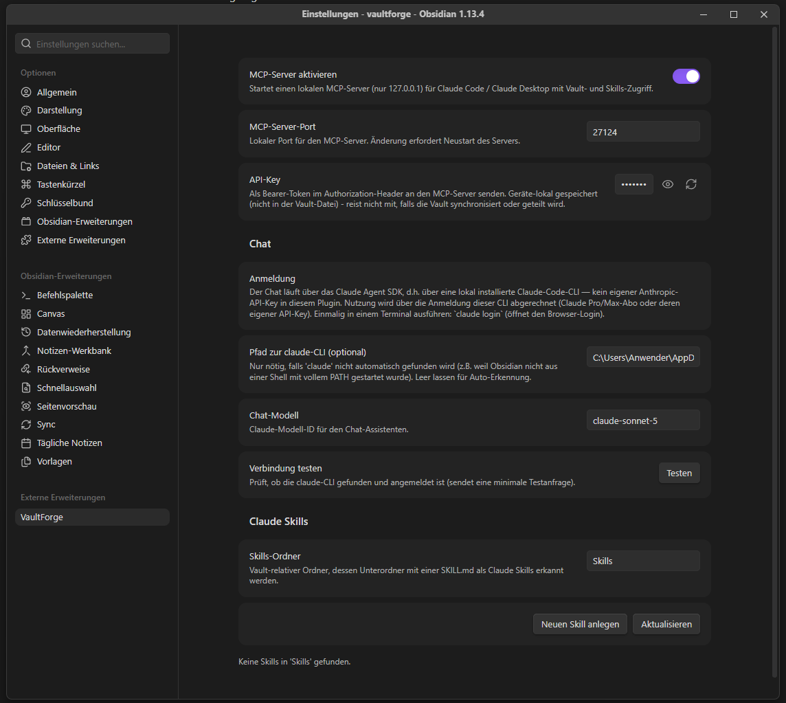
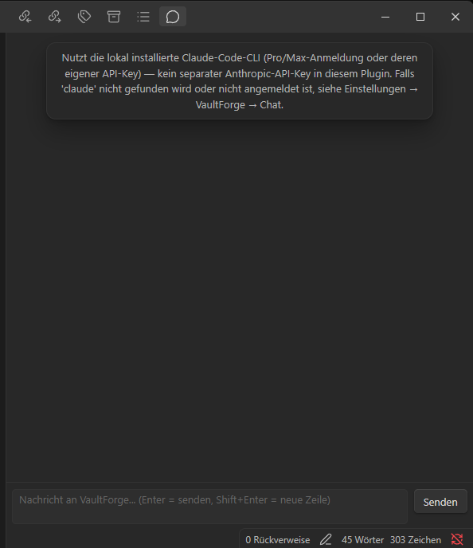

# VaultForge

<p align="center">
  
</p>

VaultForge is an Obsidian community plugin that brings Claude into your vault two ways: a local [MCP](https://modelcontextprotocol.io) (Model Context Protocol) server that gives Claude Code / Claude Desktop live read, write, and search access to your notes (no separate REST API or bridge process required), and an in-app chat sidebar backed by the same tools, authenticated through your existing Claude Code login instead of a separate API key.

> **Status:** early development. Core MCP server, vault tools, the chat assistant, and Claude Skills management are functional; template generation is planned next.

## Table of contents

- [Why VaultForge](#why-vaultforge)
- [Localization](#localization)
- [Installation](#installation)
- [Setup](#setup)
  - [MCP server settings](#mcp-server-settings)
  - [Chat assistant settings](#chat-assistant-settings)
  - [Claude Skills settings](#claude-skills-settings)
- [Using VaultForge](#using-vaultforge)
  - [Chat sidebar](#chat-sidebar)
  - [Connecting an external MCP client](#connecting-an-external-mcp-client)
- [Chat assistant](#chat-assistant)
  - [Prerequisites](#prerequisites)
  - [Troubleshooting](#troubleshooting)
- [Claude Skills](#claude-skills)
- [How it works](#how-it-works)
- [Available MCP tools](#available-mcp-tools)
- [Security model](#security-model)
- [Development](#development)
- [Testing](#testing)
- [Project structure](#project-structure)
- [Roadmap](#roadmap)

## Why VaultForge

I didn't want another AI plugin where it's unclear where my notes actually end up once I use it. VaultForge's own server component (the MCP server) never leaves your machine — it's bound to `127.0.0.1`, with no VaultForge-run backend or proxy in between (see [Security model](#security-model)). The one feature that does send vault content off your machine, the chat sidebar, goes straight to Anthropic through the `claude` CLI login you already have — not through a separate API key or server this plugin manages. Practically, that also means chat usage rides on your existing Claude Pro/Max subscription (or whatever `ANTHROPIC_API_KEY` the CLI is already configured with), instead of adding a new, separate pay-per-token cost on top.

Existing options each cover part of the problem:

| Plugin | Chat/Agent | Claude Code agent | Skills support |
|---|---|---|---|
| Claudian | ✅ | ❌ | ❌ |
| Local REST API + MCP (coddingtonbear) | ➖ (via external MCP client) | ✅ | ➖ |
| **VaultForge** | ✅ (Pro/Max-authenticated, no separate API key) | ✅ (via MCP) | ✅ — core focus |

VaultForge's differentiator is treating **Claude Skills as first-class citizens inside the vault**, not just chat and file access.

## Localization

The UI (settings tab, chat sidebar, notices, and error messages) is available in **English** and **German**. The language follows whatever display language is set in Obsidian's own **Settings → General → Language**; English is used for every other language. Tool descriptions and the chat system prompt sent to the model are not localized, since they're never shown in the UI — see [src/i18n.ts](src/i18n.ts) for the string table.

## Installation

VaultForge is not yet on the Obsidian community plugin registry. Manual install:

1. Build the plugin — see [Development](#development). This produces `manifest.json`, `main.js` (which includes the bundled Claude Agent SDK — see [Chat assistant](#chat-assistant)), and `styles.css`.
2. Copy those three files into `<YourVault>/.obsidian/plugins/vaultforge/`. (`npm run sync` does this for the bundled test vault automatically — see [Testing](#testing).)
3. In Obsidian: **Settings → Community plugins** → disable "Restricted mode" if needed → enable **VaultForge**.

Once the plugin is enabled, continue with [Setup](#setup) to configure it.

## Setup

Everything below lives in **Settings → VaultForge** inside Obsidian. The plugin has three independent features — enable only the ones you need.

<p align="center">
  
</p>

### MCP server settings

Needed if you want an external client (Claude Desktop, Claude Code) to read/write/search your vault over MCP.

- Toggle **Enable MCP server** on. A notice confirms it's listening on `127.0.0.1:<port>`.
- **MCP server port** — default `27124`. Change it and re-toggle the server off/on to apply.
- **API key** — auto-generated on first use, shown masked; click the eye icon to reveal it. You'll need it for [connecting an external MCP client](#connecting-an-external-mcp-client). See [Security model](#security-model) for how it's stored and rotated.

### Chat assistant settings

Needed if you want to use the in-app chat sidebar. This requires the Claude Code CLI installed and logged in on this machine *first* — see [Prerequisites](#prerequisites) for the one-time setup, then come back here:

- **Path to claude CLI** — leave empty; only set this if auto-detection fails (see [Troubleshooting](#troubleshooting)).
- **Chat model** — the Claude model ID the chat assistant should use.
- **Test connection** — click to confirm the CLI is found and logged in before relying on the chat.

### Claude Skills settings

Optional. Lets the chat assistant (and external MCP clients, via `skills_list`) discover Claude Skills stored in your vault.

- **Skills folder** — vault-relative folder whose immediate subfolders (each containing a `SKILL.md`) are treated as skills. Default `Skills`.
- **Create new skill** scaffolds a new `Skills/<name>/SKILL.md`; the list below the field lets you open or delete existing skills. See [Claude Skills](#claude-skills) for how discovery works.

## Using VaultForge

### Chat sidebar

<p align="center">
  
</p>

1. Click the message-circle icon in the ribbon (or run the **VaultForge: Open chat** command) to open the chat view in the right sidebar.
2. Ask questions or give instructions. The assistant has the same `vault_read` / `vault_patch` / `search_query` / `skills_list` tools available as external MCP clients — registered as an in-process MCP server via the Agent SDK (`createSdkMcpServer`) and executed directly against `app.vault`, with the CLI's own built-in tools (Bash, file access, etc.) explicitly disabled. Every tool call is shown inline in the transcript (`🔧 tool(args)`) for transparency.

This is a v1: responses are non-streaming (a single request/response per turn) and the CLI's own on-disk session is resumed turn-to-turn via its session ID, but the *rendered* transcript is in-memory only, cleared on reload.

### Connecting an external MCP client

Once the server is running (default `http://127.0.0.1:27124/mcp`), point an MCP-capable client at it with the bearer token from the settings tab.

Example: quick manual check with `curl`:

```bash
curl -X POST http://127.0.0.1:27124/mcp \
  -H "Authorization: Bearer <API-KEY-FROM-SETTINGS>" \
  -H "Content-Type: application/json" \
  -H "Accept: application/json, text/event-stream" \
  -d '{"jsonrpc":"2.0","id":1,"method":"tools/list"}'
```

**Windows / PowerShell:** the `\` line continuation above is Bash-only — PowerShell splits each line into its own command. Use `` ` `` instead, and call `curl.exe` explicitly (plain `curl` is a PowerShell alias for `Invoke-WebRequest`, which takes different flags):

```powershell
curl.exe -X POST http://127.0.0.1:27124/mcp `
  -H "Authorization: Bearer <API-KEY-FROM-SETTINGS>" `
  -H "Content-Type: application/json" `
  -H "Accept: application/json, text/event-stream" `
  -d '{"jsonrpc":"2.0","id":1,"method":"tools/list"}'
```

This should return a JSON-RPC response listing `vault_read`, `vault_patch`, and `search_query`.

For Claude Desktop / Claude Code, add an HTTP MCP server entry pointing at the same URL and header, per that client's MCP configuration docs.

## Chat assistant

VaultForge's chat sidebar (separate from, and independent of, the MCP server above — this is the plugin acting as a client, not a server) runs on the **[Claude Agent SDK](https://code.claude.com/docs/en/agent-sdk/typescript)** rather than a raw Anthropic API key: under the hood it shells out to a locally installed, logged-in `claude` CLI (the same one Claude Code / the VS Code extension use), so usage is billed through *that* login — a Claude Pro/Max subscription, or whatever `ANTHROPIC_API_KEY` the CLI itself is configured with — never a separate pay-per-token key this plugin manages.

**Why not a direct API key, and why not "log in with Claude Pro" from inside the plugin?** The browser-based OAuth login that Claude Code / the VS Code extension use to unlock Pro/Max-subscription usage is Anthropic's own proprietary flow, built into the `claude` CLI — there is no public API for a third-party app to trigger that login itself. The Agent SDK is the officially supported way to reuse an *existing* CLI login from your own code, but the login step (`claude login`, opens a browser) has to happen once, outside the plugin, in a terminal.

### Prerequisites

The chat assistant needs the Claude Code CLI installed and logged in **on the machine running Obsidian**, before it will work. This is a one-time setup, done in a terminal — not inside Obsidian.

**1. Install Node.js 22 or newer**, if you don't already have it — [nodejs.org](https://nodejs.org) (`@anthropic-ai/claude-code` requires it). Check with:

```powershell
node --version
```

**2. Install the Claude Code CLI globally:**

```powershell
npm install -g @anthropic-ai/claude-code
```

(Or use the [official installer](https://code.claude.com/docs/en/claude-code/setup) instead of npm, if you prefer.)

**3. Verify it actually installed:**

```powershell
claude --version
```

This should print something like `2.1.226 (Claude Code)`. **If instead you get an error dialog like "Not a valid Win32 application" / "Unsupported 16-bit application"** when running `claude`, the npm install downloaded the wrapper but failed to fetch the actual native binary for your platform (a flaky network connection during install is the usual cause). Fix it by installing the missing platform package explicitly and re-running the linking step:

```powershell
# Match the version to what `claude-code` itself installed - check with:
#   npm view @anthropic-ai/claude-code version
npm install -g @anthropic-ai/claude-code-win32-x64@<version>

# Then re-run the postinstall step that links the binary in:
node "$env:APPDATA\npm\node_modules\@anthropic-ai\claude-code\install.cjs"
```

Run `claude --version` again to confirm it's fixed. (On macOS/Linux the equivalent platform package is `@anthropic-ai/claude-code-darwin-arm64`, `-darwin-x64`, `-linux-x64`, or `-linux-arm64` — same idea, no `install.cjs`-path quoting needed.)

**4. Log in:**

```powershell
claude login
```

This opens a browser. Pick **"Claude account"** to use your Claude Pro/Max subscription (this is what makes chat usage *not* bill per token) — or, if you'd rather pay per token through the API, configure `ANTHROPIC_API_KEY` for the CLI instead and skip this step.

**5. Confirm you're actually logged in and can reach the model:**

```powershell
claude -p "Say OK"
```

A one-line `OK` back means everything above worked.

**6. Fully restart Obsidian** (quit it completely — not just reload the window/vault). This matters because Obsidian, like any already-running GUI app, only reads your system `PATH` once at launch; if `claude` was installed *after* Obsidian was last started, it won't be visible on `PATH` until Obsidian restarts.

**7. In Obsidian: Settings → VaultForge → Chat → "Test connection".** This should now report success. If it still can't find `claude`, set **"Path to claude CLI"** to the full path instead of relying on `PATH` — e.g. on Windows:

```
C:\Users\<you>\AppData\Roaming\npm\node_modules\@anthropic-ai\claude-code\bin\claude.exe
```

(find yours with `(Get-Command claude).Source` in PowerShell, once step 3 above works there).

### Troubleshooting

| Symptom | Fix |
|---|---|
| `claude`: "Not a valid Win32 application" / "Unsupported 16-bit application" | The native binary didn't download — see step 3 above. |
| VaultForge: "claude CLI was not found" even though `claude --version` works in a terminal | Obsidian hasn't picked up the updated `PATH` — fully quit and restart it (step 6), or set the CLI path explicitly in settings (step 7). |
| VaultForge: "Not logged in to Claude Code" | Run `claude login` in a terminal (step 4), then retest. |
| Chat hangs with no response | The `claude` process likely isn't responding (network issue, or the CLI itself is stuck) — try the same prompt directly via `claude -p "..."` in a terminal to see the raw error. |

**Deployment note (for contributors):** the Claude Agent SDK is bundled directly into `main.js` at build time, same as every other dependency — no extra files to copy. It deliberately does **not** ship the SDK's own optional, platform-specific ~250 MB bundled CLI binary package; the plugin always talks to the `claude` CLI you separately install and log in with (auto-detected on `PATH`, or the "Path to claude CLI" override), so there's nothing platform-specific left that bundling could break. (Runtime `import()`/`require()` of an external node_modules package was the first approach here, but Obsidian's plugin sandbox turned out to have no reliable way to do that — bare specifiers fail to resolve, and even an explicit `file://` URL fails to fetch — so bundling won this one.)

**Open TODOs:** the Agent SDK migration surfaced several Obsidian-plugin-sandbox-specific runtime quirks (documented in `esbuild.config.mjs`, `esbuild-shims.mjs`, and the module doc comment in `src/claude/agent.ts`); the workarounds are in place and the plugin loads and reaches the CLI-spawn step cleanly, but a few things still need real end-to-end verification, not just "doesn't crash on load":

- [x] A full chat turn actually succeeding (send a message, get a reply) against a properly installed, logged-in `claude` CLI — confirmed via the "Test connection" button. (Needed two fixes on a real machine beyond what's in code: the native `win32-x64` binary had to be installed separately after a failed npm download — `npm install -g @anthropic-ai/claude-code-win32-x64@<version matching claude-code>`, then `node node_modules/@anthropic-ai/claude-code/install.cjs` to link it in — and Obsidian needed a full restart, or the "Path to claude CLI" override, to see `claude` on `PATH` at all, since a running GUI app doesn't pick up a PATH change until relaunched.)
- [ ] A tool call actually round-tripping end-to-end through the chat UI (`vault_read` / `vault_patch` / `search_query` / `skills_list`) — the in-process MCP server wiring is untested against a live session.
- [ ] Multi-turn session resume (`sessionId` carried across turns) confirmed to actually continue the same CLI-side conversation, not just avoid an error.
- [ ] Cross-platform check of the `esbuild-shims.mjs` workarounds (`import.meta.url` shim, `AbortController`-via-`EventEmitter` shim) — everything so far was only observed on Windows; macOS/Linux may behave differently (or may not have needed the workarounds at all).
- [ ] Regression-check the MCP server feature (`src/mcp/server.ts`) still behaves correctly — it's unrelated to the chat assistant but now shares the same bundle and the same bundle-wide `AbortController` substitution.
- [ ] Decide whether to surface the CLI's auth source (`apiKeySource` on the SDK's init message — `"oauth"` for a Pro/Max login vs an API key) in the chat UI or settings, so it's visible at a glance which billing path is active.

## Claude Skills

VaultForge treats a vault folder (configured under [Claude Skills settings](#claude-skills-settings)) as a directory of Claude Skills — one subfolder per skill, each containing a `SKILL.md` with `name`/`description` frontmatter, following the same progressive-disclosure pattern Claude Skills use elsewhere: the chat assistant's system prompt lists every discovered skill's name and description, and it loads the full `SKILL.md` via `vault_read` only when a skill is actually relevant. The same discovery is exposed to external MCP clients via the `skills_list` tool.

This mirrors the *discovery* pattern of native Claude Skills, but not the full mechanism: only `name`/`description` frontmatter is parsed (no `allowed-tools` or permissions), a skill is a single `SKILL.md` (no bundled scripts/resources), and it's loaded as plain instruction text via `vault_read` rather than invoked through the CLI's own `Skill` tool (which is disabled for this chat, along with all other built-in tools).

## How it works

Everything runs inside the same process as Obsidian itself (the Electron renderer). The plugin is marked `isDesktopOnly: true` in `manifest.json`, which is what allows it to import Node.js core modules (`http`, `crypto`) that wouldn't otherwise be available in a browser-style plugin context.

```
Obsidian (Electron renderer process)
└─ VaultForge plugin
   ├─ Settings tab (toggle server, configure port, view API key)
   └─ MCP server (src/mcp/server.ts)
      ├─ node:http server, bound to 127.0.0.1 only
      ├─ StreamableHTTPServerTransport (@modelcontextprotocol/sdk)
      └─ Tools → operate directly on `app.vault` (Obsidian's Vault API)
```

**Request flow, step by step:**

1. Plugin loads → reads settings from `data.json` (`mcpServerEnabled`, `mcpServerPort`). The API key is loaded separately via `app.loadLocalStorage()` — see [Security model](#security-model) for why it's kept out of `data.json`.
2. If the server is enabled, `VaultForgeMcpServer.start()` registers the three tools below on an `McpServer` instance and starts a plain Node `http.Server` listening on `127.0.0.1:<port>`.
3. For every incoming request:
   - Only `POST /mcp` is accepted — everything else gets a `404`.
   - The `Authorization: Bearer <apiKey>` header is checked — missing or wrong key gets a `401`.
   - The JSON body is parsed manually (no Express, no body-parser dependency).
   - A **fresh `StreamableHTTPServerTransport`** is created per request (stateless mode: `sessionIdGenerator: undefined`), which avoids request-ID collisions across concurrent calls.
   - The MCP server connects to that transport and hands off the request; the transport bridges Node's `req`/`res` to the Web-standard Request/Response objects the MCP protocol expects (via `@hono/node-server` internally), runs the matching tool handler, and writes the JSON-RPC response back.
4. On disconnect (`res.on("close")`) the transport is closed and cleaned up.

Because the server lives inside the same process as Obsidian, tool handlers call `app.vault` directly — there's no HTTP hop to a separate REST API layer like in the Local REST API + MCP reference setup.

## Available MCP tools

| Tool | Description |
|---|---|
| `vault_read` | Reads a note's content by vault-relative path. |
| `vault_patch` | Creates or edits a note. `mode`: `overwrite` (default), `append`, `prepend`, or `create` (fails if the file already exists). |
| `search_query` | Case-insensitive substring search across all Markdown notes; returns matching paths with a snippet around each hit. |
| `skills_list` | Lists Claude Skills found under the configured skills folder (name + description, parsed from each `SKILL.md`'s frontmatter). |

## Security model

**Network usage.** The MCP server (above) only ever binds to `127.0.0.1` and makes no outbound calls itself — it's a passive local endpoint for MCP clients you point at it. The **chat sidebar** is the one feature that sends data off your machine: a chat turn goes to Anthropic's API through the `claude` CLI's own login (your Claude Pro/Max subscription, or the API key that CLI is configured with — see [Chat assistant](#chat-assistant)), and any `vault_read`/`vault_patch`/`search_query` tool call the assistant makes during that turn sends the matching note content along with it. No other remote service is contacted, and VaultForge itself never sees or stores an Anthropic API key.

A local HTTP server with vault read/write access is a real attack surface on shared machines, so VaultForge applies the same baseline as the Local REST API plugin, plus one deliberate deviation:

- **Localhost-only binding** — the server listens on `127.0.0.1`, never `0.0.0.0`; it is not reachable from the network.
- **Bearer-token authentication** — a random 24-byte hex API key is generated on first use. Every request must include `Authorization: Bearer <key>`. No key is baked into the code or shipped anywhere — each installation generates its own.
- **Key storage: device-local, not vault-local.** The key is stored via Obsidian's `app.saveLocalStorage()` / `loadLocalStorage()` API instead of the plugin's `data.json`. `data.json` lives inside the vault and travels with it — through Obsidian Sync, iCloud/Dropbox/OneDrive, a shared team vault, or (if someone ever slipped up) a git commit. `localStorage` values do not; they're tied to Obsidian's own app data on that specific device. So if the vault is ever synced or shared, the bearer token doesn't go along for the ride.
  - We looked at Electron's `safeStorage` (OS-keychain-backed encryption) first, since the plugin already has Node/Electron access via `isDesktopOnly: true`. It's confirmed unavailable to Obsidian plugins (disabled in the renderer sandbox — see the [Obsidian forum thread](https://forum.obsidian.md/t/electron-safestorage-available/54844)), so `loadLocalStorage` is the practical alternative that still solves the actual risk (the key propagating via a synced/shared vault).
- **Masked in the UI** — the settings tab shows the key as a password field by default (eye-icon toggle to reveal), so it isn't casually exposed via screenshots or screen shares.
- **One-click rotation** — a "regenerate" button in settings issues a new key (with a confirmation prompt, since it invalidates already-configured MCP clients) and restarts the server if it's running.
- **Legacy cleanup** — earlier builds stored the key in `data.json`. `loadSettings()` detects and strips that field automatically on load so it stops lingering in vault files from older installs.

## Development

Requirements: Node.js, npm.

```bash
npm install       # install dependencies
npm run dev        # esbuild in watch mode → builds main.js on every change
npm run build       # type-check (tsc --noEmit) + production build (minified)
npm run sync         # copy manifest.json + main.js + styles.css into the bundled test vault
```

`npm run build` and `npm run sync` are separate on purpose: `build` produces the artifacts, `sync` deploys them into the local test vault described below.

## Testing

This repository ships a ready-to-use test vault at [`vaultforge/`](vaultforge/) (it already contains a `.obsidian/` folder, so Obsidian recognizes it as a vault).

**One-time setup / after every change:**

```bash
npm run build && npm run sync
```

This compiles the plugin and copies the build output into `vaultforge/.obsidian/plugins/vaultforge/`.

**In the Obsidian desktop app:**

1. **Open folder as vault** → select the `vaultforge/` folder in this repo.
2. **Settings → Community plugins** → disable restricted mode if prompted.
3. Enable **VaultForge** in the plugin list.
4. Open the VaultForge settings pane and toggle the **MCP server** on — a notice confirms the port, and a masked API key field appears. Click the eye icon to reveal it, or the refresh icon to rotate it.
5. Verify the server responds using the `curl` command from [Connecting an external MCP client](#connecting-an-external-mcp-client).

**Iterating on code changes:**

Run two terminals:

```bash
# terminal 1 — rebuilds main.js automatically on save
npm run dev

# terminal 2 — run after each meaningful change
npm run sync
```

Obsidian does **not** hot-reload plugin files automatically. After syncing, reload the plugin (toggle it off/on in Community plugins) or reload the whole app (`Ctrl/Cmd+P` → "Reload app without saving") to pick up the new `main.js`.

> **Tip:** installing the community "Hot Reload" plugin (by pjeby) inside the test vault will auto-reload VaultForge whenever `main.js` changes, removing the manual reload step.

**Windows note:** a symlink from the test vault's plugin folder to the project root would avoid the copy step entirely, but `New-Item -ItemType SymbolicLink` requires Administrator rights or Developer Mode enabled on Windows — hence the `npm run sync` copy script instead.

## Project structure

```
vaultforge-obsidian/
├─ manifest.json          # Obsidian plugin manifest
├─ package.json
├─ tsconfig.json
├─ esbuild.config.mjs      # bundles src/main.ts → main.js
├─ esbuild-shims.mjs        # runtime shims (import.meta.url, AbortController) the bundled Agent SDK needs inside Obsidian's plugin sandbox
├─ version-bump.mjs        # keeps manifest.json/versions.json in sync on release
├─ copy-to-vault.mjs        # deploys build output into the local test vault
├─ styles.css               # chat UI styling (copied into the vault by `npm run sync`)
├─ src/
│  ├─ main.ts              # plugin entry point, settings tab, server/chat lifecycle
│  ├─ tools.ts              # shared vault_read/vault_patch/search_query handlers (used by MCP server + chat)
│  ├─ skills.ts             # Claude Skills discovery (SKILL.md frontmatter) + scaffold creation
│  ├─ mcp/
│  │  └─ server.ts          # MCP server: HTTP transport, auth, tool definitions
│  ├─ claude/
│  │  └─ agent.ts           # Claude Agent SDK wrapper: in-process MCP tool server + session-resume chat turns
│  └─ chat/
│     └─ ChatView.ts         # sidebar chat ItemView
└─ vaultforge/              # bundled test vault
   └─ .obsidian/             # personal/session config (workspace.json etc.) gitignored
      └─ plugins/vaultforge/ # build output (manifest.json/main.js/styles.css) - tracked; data.json (no secrets) tracked too
```

> The MCP bearer token is never in any of these files — it lives in `localStorage`, outside the vault folder entirely. See [Security model](#security-model). The chat assistant stores no credentials at all in this plugin — it defers to the `claude` CLI's own login.

## Roadmap

- [x] Plugin scaffold (esbuild, TypeScript, manifest)
- [x] Local MCP server with `vault_read` / `vault_patch` / `search_query`
- [x] Chat / coding assistance UI inside Obsidian
- [ ] Template generation for notes
- [x] Claude Skills discovery and management from within the vault
